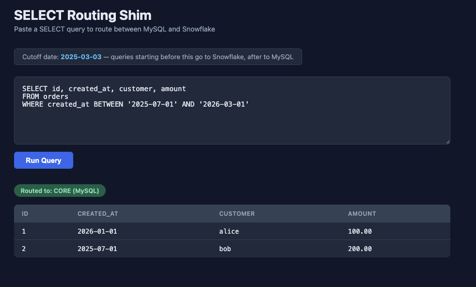
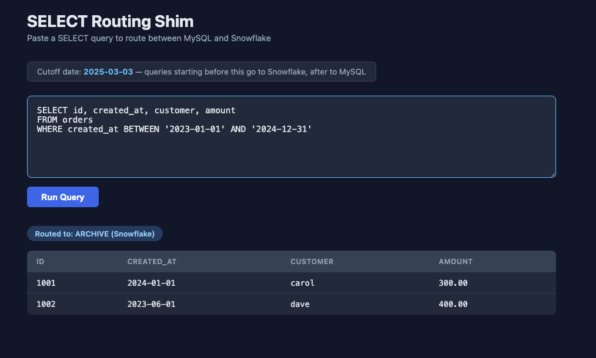

# SELECT Routing Shim

A Perl query routing shim that directs `SELECT` statements to **MySQL** (recent data) or **Snowflake** (archived data) based on date range.

## How It Works

A cutoff date is computed as today minus `ROUTE_DAYS` (default 365). The `BETWEEN` start date in your query decides the target:

- **Start date >= cutoff** &rarr; MySQL
- **Start date < cutoff** &rarr; Snowflake

## Setup

### 1. Configure credentials

```bash
cp .env.example .env
```

Edit `.env` with your Snowflake account, username, and password.

### 2. Create the Snowflake archive table

Run in a Snowflake worksheet:

```sql
CREATE DATABASE IF NOT EXISTS ARCHIVEDB;
CREATE SCHEMA IF NOT EXISTS ARCHIVEDB.PUBLIC;

CREATE TABLE IF NOT EXISTS ARCHIVEDB.PUBLIC.orders (
  id INTEGER,
  created_at DATE,
  customer STRING,
  amount NUMBER(10,2)
);

INSERT INTO ARCHIVEDB.PUBLIC.orders VALUES
(1001, '2024-01-01', 'carol', 300.00),
(1002, '2023-06-01', 'dave', 400.00);
```

### 3. Run

```bash
docker compose up --build
```

Open **http://localhost:3000**

## Example Queries

### MySQL (recent data)

```sql
SELECT id, created_at, customer, amount
FROM orders
WHERE created_at BETWEEN '2025-07-01' AND '2026-03-01';
```



### Snowflake (archived data)

```sql
SELECT id, created_at, customer, amount
FROM orders
WHERE created_at BETWEEN '2023-01-01' AND '2024-12-31';
```



## Stopping

```bash
docker compose down
```
